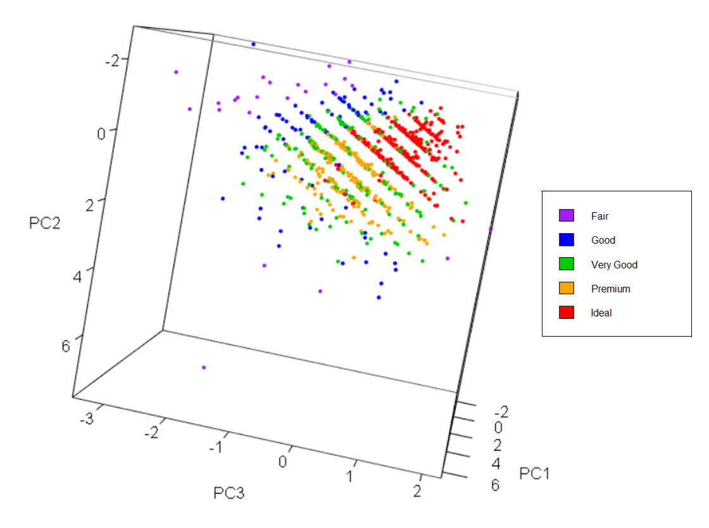

```{r setup, include=FALSE}
knitr::opts_chunk$set(echo = FALSE)
knitr::opts_chunk$set(warning = FALSE, message = FALSE) 

library(MASS)
library(ggplot2)
library(data.table)
library(mltools)
library(reshape)
library(reshape2)
library(rmarkdown)
library(tidyverse)
library(knitr)
data(diamonds)
# ctrl + alt + I
```


```{r echo=FALSE, fig.align='center', out.width='40%'}
# Include images and pictures using .png files in the Images folder..(only if you want to.. =))
knitr::include_graphics(c("Images/Universe2.png"))
```

\begin{center}
CONTRIBUTION TABLE : Group 640
\end{center}

Task          |     Oriade    |     Pietro    |
--------------|:-------------:|:-------------:|
**Student ID**|   s172084     |    s231756    |
------------- |-------------- | ------------- | 
Question 1    |       x       |               |   
------------- | ------------- | ------------- |
Question 2    |       x       |               | 
------------- | ------------- | ------------- |
Question 3    |               |       x       |  
------------- | ------------- | ------------- |
Question 4    |               |       x       |
------------- | ------------- | ------------- |
Exam Prob 1   |               |       x       | 
------------- | ------------- | ------------- |
Exam Prob 2   |       x       |               |
------------- | ------------- | ------------- |
Exam Prob 3   |       x       |               |
------------- | ------------- | ------------- |
Exam Prob 4   |               |       x       |
------------- | ------------- | ------------- |
Exam Prob 5   |       x       |               |
------------- | ------------- | ------------- |
Exam Prob 6   |               |       x       |

\newpage

```{=latex}
\setcounter{tocdepth}{4}
\tableofcontents
```
\ 
\ 
\ 
\ 
```{r echo=FALSE, fig.align='default', out.width='30%'}
# Include images and pictures..

knitr::include_graphics(c('Images/Diamond_Group.png','Images/Diamond_Group.png','Images/Diamond_Group.png'))
```
\newpage

# Question 1

## Introduction to the Dataset 

The International Diamond Grading System, created by The Gemological Institute of America,focuses on the 4C’s as a means to categorise diamonds. The categories are explained on the Diamonds Search Engine, which contains information about how loose diamonds are graded. 

The Diamonds dataset used in this report is based on the Diamonds Search Engine [1]. 

The 4C’s include :

* carat 
* cut
* colour and
* clarity. 

The Diamonds dataset was obtained from the TidyVerse package developed in R by Hadley Wickham and other contributors [4]. 

The Diamonds dataset records 53,940 rows of diamonds and registers 10 attributes , including the 4C’s. 

Below, there is a brief overview about the variables in the dataset. 

The length (**X**) , width (**Y**) and depth (**Z**) of each diamond has been measured. The length ranges from 0 mm to 10.74 mm. The width ranges from 0 mm to 58.9 mm and the depth ranges from 0 to 31.8 mm. 

The carat of a diamond represents the weight of a diamond. The carat ranges from 0.2 to 5.01 carats, where 1 carat is equal to 200 milligrams (1/5 th of a gram). 

The quality of the cut is categorised into fair, good, very good, premium and ideal. The cut is an important feature because it determines the sparkle and brilliance observed due to light refraction, which potentially has an influence on the price. 

The colour of a diamond is classified from D (best) to J (lowest). The diamonds in group  D are colourless. In the international diamond grading system, colourless diamonds have the highest the grade. Diamonds that are classified as J, often have a yellow tinge. One interesting factor is the colour of the diamond, as many diamonds inside engagement rings are G to J in colour. This colour is offset by a gold or silver band [7].

Clarity is categorised from IF to I1. IF is the best class. Here, F means Flawless - without visible blemishes. Diamonds that contain inclusions that are visible to the naked eye are given the worst class of I1.  
The last 3 variables or attributes of the dataset include the price, the total depth percentage and the table. 

The price of diamonds in US dollars ranges from $326 to $18,823 US dollars. In the market, the price of diamonds may be based on the carat weight. 

The depth (total depth percentage) is a continuous variable which is the total depth, from top to bottom of each diamond, divided by the mean length and width. 

The table is a continuous variable which is a measurement of the width of the top of a diamond in relation to the widest point.

\newpage
## Statement of Interest
The idea is to analyse the dataset in order to determine relationships between variables. 
More specifically, it may be interesting to discover the relationship between two attributes: i.e. the relationship between: 

* The length and width of a colourless diamond 
* The colour and the table of the diamond
* The carat and price of a colourless diamond
* The carat and the table of a colourless diamond 
* The carat and the length of a colourless diamond 
* The carat and the width of a colourless diamond 
* The carat and the depth of a colourless diamond 
* The price corresponding to the cut of a diamond

## Data Transformation
Ideally the price could be determined in Danish Kroner, Pounds Sterling or Euros, rather the US dollars. It may also be a good idea to transform carats into milligrams to represent the weight of the diamond. The attributes that are recorded in millimetres could also be converted to micrometers. 

## Conclusion of previous Analysis

In his R publication, Jon Ong has performed a brief analysis of this dataset looking at the relationship between Cut vs. Colour, Price vs. Cut, and Price vs. Clarity. The results show that diamonds with a Premium Cut have the highest carat [5]. 

Poonam Rao has also performed a brief analysis of the diamonds dataset where she performs data visualisation using scatterplots , histograms and box-plots. She explains that diamonds that are categorised in the Ideal group with regard to cut, often have a low weight [6] .  

## Learning Aims using Classification and Regression

A regression problem analyses the relationship between a dependent variable and an independent variable. The Regression can be linear regression or multiple linear regression. 

It is possible to analyse the relationship between diamond length (**X**) and diamond width (**Y**), the carat and the depth(**Z**) in order to understand the relationship between these variables. In the regression problem, we will predict the carat based on the length, width and depth. 

It is possible to look at the relationship between carat and price for 1 specific colour, cut and clarity of diamond in our regression problem. One could observe the carat of the diamonds that are priced between $10,000 to $20,000 USD. 

A classification problem requires a dataset to be classified into two or more categories. 
One idea is to choose the category of cut and determine if the diamond is very good, premium cut or ideal cut. This can be done using the diamond length (**X**) and diamond width (**Y**), the carat and the depth(**Z**). 

Another idea is to choose the category of colour and determine if the diamond is D or J. This can be also be done using the diamond length (**X**) and diamond width (**Y**), the carat and the depth(z). 

It is also possible to choose the category of clarity and determine if the diamond  is IF , VS1 or I1 . This can be done using the diamond length (**X**) and diamond width (**Y**), the carat and the depth(**Z**). 
\newpage

# Question 2 

## Description of Attributes
**Describe if the attributes are discrete/continuous, Nominal/Ordinal/Interval/Ratio**

The table below shows the classification of the attributes. 
The cut, colour, and clarity are ordinal factor variables. In the table below, Cont. means continuous and Categ. means Categorical. 

## Attribute Table 

Attribute |     Carat   |     Cut     |     Colour  |   Clarity.  |    Depth    |   Table     |    Price   | Length (X)  | Width(Y)   | Depth  (Z)  |
----------|:-----------:|:-----------:|:-----------:|:-----------:|:-----------:|:-----------:|:----------:|:-----------:|:---------: |:-----------:| 
| Type    | Cont.       | Categ.      | Categ.      | Categ.      | Cont.       |  Cont.      | Discrete   | Cont.       | Cont.      | Cont.       |
| Type    | Ratio       | Ordinal     | Ordinal     | Ordinal     | Ratio       | Ratio       | Ratio      |   Ratio     |   Ratio    |    Ratio    |

There are no missing values or NAs in any column of the dataset. The data is tidy from the TidyVerse. In the Premium cut group and Ideal cut group of diamonds, there are some diamonds that have an outlying width, which corresponds to the VS1 ad SI2 clarity groups. 

**Include basic summary statistics of the attributes, including correlation**

There are many diamonds that have a carat between 0.2 and 1, with the average carat being 0.7.  
Therefore it may be interesting to narrow in on the dataset and only look at diamonds that are between 1 and 5 carats, and exclude all diamonds below 1 carat.
The average length of a diamond (**X**) is 5.731 mm. It may be interesting to look at diamonds that are between 6 and 10 millimetres long.  
The average price of a diamond in this dataset is $3,932.8 USD.  There is a lower quantile of $950 dollars and upper quantile of $5,324.5 USD.  It may be interesting to narrow down the price range and focus on diamonds that are between $326 - $5000 USD. However  $5000 - $15,000 USD or $10,000 -  £$20,000 USD may also be suitable ranges to focus on. 
Many of the diamonds have the average table of approximately 61.7. Diamonds have an average depth of 3.5. It may be interesting to explore diamonds that have a depth (**Z**) between 5 and 10. 
It may be interesting to choose diamonds with a specific clarity, IF, SI2, VS1 and narrow down on the cut to look at only 1 type of cut. There are 21,000 Ideal cut diamonds, which makes this the most common category.  One could choose the very good (12,082) , premium ( 13,791) or ideal cut diamonds to focus on.

## Summary Statistics Table 

 Variable           |No.Obs. $N$| Mean $\hat{\mu}$|  Variance    |Standard Dev $\hat{\sigma}$| Lower Quart | Median  | Upper quart |
 -------------------|:----------:|:----------:|:---------------:|:-----------:|:-----------:|:-------:|:-----------:|
| Carat.            |   53,940   |     0.797  |         0.2247  |    0.474    |    0.4      |    0.7  |       1.04  |
| Cut.              |   53,940   |            |                 |             |             |         |             |
| Colour            |   53,940   |            |                 |             |             |         |             |
| Clarity           |   53,940   |            |                 |             |             |         |             |
| Total Depth %     |   53,940   |    61.749  |         2.052   |    1.433    |    61       |    61.8 |      62.5   |
| Table             |   53,940   |    57.457  |         4.992   |    2.234    |    56       |    57.0 |      59.0   |
| Price             |   53,940   |  3932.80   |  15915629       |  3989.44    |   950       |   2401  |    5324.5   |
| Length(X)         |   53,940   |     5.731  |         1.258   |    1.122    |     4.71    |    5.70 |       6.54  |
| Width (Y)         |   53,940   |     5.734  |         1.305   |    1.142    |     4.72    |    5.71 |       6.54  |
| Depth(Z)          |   53,940   |     3.538  |         0.498   |    0.706    |     2.91    |    3.53 |       4.04  |

:::::: {.cols data-latex=""}

::: {.col data-latex="{0.80\textwidth}"}
From the Correlation Table it can be seen that:

* There is a positive correlation between Length(**X**) and Width(**Y**).
* There is a positive correlation between Width(**Y**) and Depth(**Z**).
* There is a positive correlation between Length(**X**) and Depth(**Z**).
* There is a positive correlation between carat and Length(**X**)
:::

::: {.col data-latex="{0.02\textwidth}"}
\ 
:::

::: {.col data-latex="{0.15\textwidth}"}
## Correlation Table 
 
 | Correlation      | Value   |
 |------------------|---------|
 | X & Y            | 0.9747  |
 | Y & Z            | 0.9520  |
 | X & Z            | 0.9707  |
 | carat & X        | 0.9750  |
:::
::::::

# Question 3

## Representation of the data set

The data set is composed by different type of data as discussed above. In order
to manage the ordinal attributes (*cut*, *color* and *clarity*), they can be 
converted into ordinal numbers (from 1 to the upper level number) according to 
their ranking.

```{r}
Dia <- as.data.frame(diamonds)
Dia$cut <- as.numeric(Dia$cut)
Dia$color <- as.numeric(Dia$color)
Dia$clarity <- as.numeric(Dia$clarity)

N <- dim(Dia)[1] # number of rows of the new one-hot-encoded dataframe
M <- dim(Dia)[2] # number of columns of the new one-hot-encoded dataframe
attributeNames <- colnames(Dia)
```

### Issues with outliers in the data

To have a general idea of the distribution of the values assumed by the
attributes, a list of histograms can be displayed:


```{r echo=FALSE}
# histogram
yvals <- c()
for (m in 1:M)
{
  res <- hist(Dia[, m], plot = FALSE)
  yvals <- c(yvals, res$counts)
}

# The argument ylim ensures that all histograms are plotted on the same y-axis
{
  par(mfrow = c(2, 5))
  hist(Dia[, 1], main = attributeNames[1], xlab = NULL, ylim = c(min(yvals), max(yvals)))
  hist(Dia[, 2], main = attributeNames[2], xlab = NULL, ylim = c(min(yvals), max(yvals)), breaks=0.5+seq(0,5))
  hist(Dia[, 3], main = attributeNames[3], xlab = NULL, ylim = c(min(yvals), max(yvals)), breaks=0.5+seq(0,7))
  hist(Dia[, 4], main = attributeNames[4], xlab = NULL, ylim = c(min(yvals), max(yvals)), breaks=0.5+seq(0,8))
  for (m in 5:M)
  {
    hist(Dia[, m], main = attributeNames[m], xlab = NULL, ylim = c(min(yvals), max(yvals)))
  }
}
```

\newpage
Some of the histograms seem to be affected by outliers in the data. It can be
seen by looking at the horizontal axis of each graph and by noticing that
bins do not cover all the axis values but only a limited range. This is very
evident in the attributes *table* and in the dimensions *y* and *z*.
This attributes contain very extreme values that wrongly set the axis limits. In order
to detect them, the data set can be sorted from the smallest value of a specific
attribute to the largest value of the same attribute. By doing so, it can be
selected the $99.99^{th}$ percentile, which corresponds to the highest observations of
the data set sorted by one of the attributes. If the values assumed by the
attribute are not physical or are very different from the other values, the
specific observation can be discarded.

The $99.99^{th}$ percentile of the data set sorted by the *table* shows the following
data:
```{r}
i <- 6 # table
IdxOutlier <- Dia[,i] > quantile(Dia[,i],.9999)
(Outlier <- Dia[which(IdxOutlier), ])
```
The first row has a value of *table* very far from the other two rows. It is
very unlikely that, considering a data set of 53940 diamonds, there is a diamond with
the *table* 16 percentage points bigger than the second-biggest *table* diamond.
For this reason, the row nr. 24933 of the data set will be canceled.

As for the attribute *y* (width), it can be followed the same procedure by sorting
the data set by the width and looking at the $99.99^{th}$ percentile:
```{r}
i <- 9 # width (y)
IdxOutlier <- Dia[,i] > quantile(Dia[,i],.99994)
(Outlier <- Dia[which(IdxOutlier), ])
```
It can be seen that the first and the last rows have very larger values of *y* with respect
to the the other two rows belonging to the $99.99^{th}$ percentile. It is very
unlikely that, considering such a big number of diamonds, there are two diamonds
with dimensions so different from the others. So the two rows containing the
two outliers will be canceled

Finally, sorting the data set by the *z*-dimension, the $99.99^{th}$ percentile
is composed by the following records:
```{r}
i <- 10 # depth (z)
IdxOutlier <- Dia[,i] > quantile(Dia[,i],.99995)
(Outlier <- Dia[which(IdxOutlier), ])
```
The last record has a value of *z* very far from the other ones, so it can be
considered as an outlier and so it will be removed from the data set.

\newpage
### Possible distributions followed by the data

Now that the data set is free from outliers, the histograms of the attributes
will be more meaningful about the possible distribution the data follow for each
variable:

```{r echo=FALSE}
nr <- c(24068,49190,48411,24933)
Dia <- Dia[-nr, ]
N <- N - length(nr)

yvals <- c()
for (m in 1:M)
{
  res <- hist(Dia[, m], plot = FALSE)
  yvals <- c(yvals, res$counts)
}

# The argument ylim ensures that all histograms are plotted on the same y-axis
{
  par(mfrow = c(2, 5))
  hist(Dia[, 1], main = attributeNames[1], xlab = NULL, ylim = c(min(yvals), max(yvals)))
  hist(Dia[, 2], main = attributeNames[2], xlab = NULL, ylim = c(min(yvals), max(yvals)), breaks=0.5+seq(0,5))
  hist(Dia[, 3], main = attributeNames[3], xlab = NULL, ylim = c(min(yvals), max(yvals)), breaks=0.5+seq(0,7))
  hist(Dia[, 4], main = attributeNames[4], xlab = NULL, ylim = c(min(yvals), max(yvals)), breaks=0.5+seq(0,8))
  for (m in 5:M)
  {
    hist(Dia[, m], main = attributeNames[m], xlab = NULL, ylim = c(min(yvals), max(yvals)))
  }
}
```


From the graphs, some considerations about the distribution of each attribute
can be listed:

* attributes *depth* and *table* appear to be normally distributed since they
follow quite well the gaussian bell curve and they are almost symmetric;
* attributes *carat* and *price* seem to follow an exponential distribution,
since each bin is smaller than the previous one and larger than the following one;
* attributes *clarity*, *x*, *y* and *z* appear to follow a log-normal distribution,
since they follow a asymmetric bell curve with the sample-mode smaller than the mean.

\newpage
### Correlation of variables

Correlation between variables can be studied by producing the matrix of scatter 
plots of each combination of two attributes against each other. Scatter plots
are not so meaningful with ordinal data (*cut*, *color* and *clarity*), so they
are removed from the data set and points of the plots are colored according to
the attribute *cut* in the attempt of finding some pattern of the data. The matrix
is shown below:

```{r echo=FALSE}
Dia_qty <- Dia[,c(1:2,5:10)]
Dia_qty <- Dia_qty[sample(nrow(Dia_qty), size=1000), ]
Cut <- Dia_qty[,2]
Dia_qty <- as.data.frame(Dia_qty[,c(1,3:8)])
colnames(Dia_qty) <- c("carat","depth","table","price","x","y","z")
observationColors <- c("blue", "green3", "red","orange","purple")[unclass(Cut)]
classNames <- as.character(levels(diamonds$cut))
{
  par(xpd=TRUE)
  pairs(Dia_qty, bg=observationColors, pch=21)
  legend(0, 1, classNames, fill=unique(observationColors))
}
```

The plots confirm the very high correlation between the variables *carat*, *x*,
*y* and *z*, as already computed in the Correlation Table (page 6). In addition, also the *price*
appears to be slightly correlated with the variables *carat*, *x*, *y* and *z*.
The other variables do not show any specific pattern and also the *cut* does not
seem to distinguish any cluster of the data.

\newpage
## Principal Component Analysis

The aim of the Principal Component Analysis ("PCA" from now on) is to simplify
the problem dimension by reducing the number of interval or ratio variables which explains the
behavior of diamonds. So, for the PCA, the categorical attributes *cut*, *color* and *clarity*
are removed from the data set.

```{r}
D_pca <- as.data.frame(diamonds[,c(1,5:10)]) # drop categorical attibutes
N <- dim(D_pca)[1] # number of rows
M <- dim(D_pca)[2] # number of columns
attributeNames <- colnames(D_pca)

stds <- apply(D_pca, 2, sd)
```

Looking at the "Summary Statistics Table" (page 5), standard deviation of *price* is some orders of magnitude larger than the 
others, so the dataset has to be standardized by subtracting the mean and dividing
by the standard deviation of the whole set of observations of that variable.
```{r}
D_pca <- t(apply(D_pca, 1, "-", colMeans(D_pca)))
D_pca <- t(apply(D_pca, 1, "*", 1 / stds))
D_pca <- as.data.frame(D_pca)
```

:::::: {.cols data-latex=""}

::: {.col data-latex="{0.55\textwidth}"}
```{r, echo=FALSE, fig.width=5, fig.height=4}
S <- svd(D_pca)
diagS <- S$d
rho <- diagS^2 / sum(diagS^2)
threshold <- 0.9

xlimits <- c(1, M)

plot(rho,
     type = "o",
     main = "Variance explained by principal components",
     xlab = "Principal components",
     ylab = "Variance explained",
     xlim = xlimits,
     ylim = c(0, 1),
     col = "blue"
)

lines(cumsum(rho), type = "o", col = "orange")
lines(xlimits, c(threshold, threshold), lty = "dashed")

legend("right", # Define position
       legend = c("Cumulative", "Individual", "Threshold"), # Set strings for legend
       col = c("orange", "blue", "black"), lty = c(1, 1, 2), # Match appereance of lines
       cex = 1, bg = "lightblue"
) # Setup how the box looks (cex controls size)
```
:::

::: {.col data-latex="{0.05\textwidth}"}
\ 
:::

::: {.col data-latex="{0.40\textwidth}"}

The new standardized data set can be now used to perform the Singular Value
Decomposition (SVD), which gives rise to three different matrices: $U$, $\Sigma$ 
and $V^T$. By the extraction of the diagonal of the matrix $\Sigma$,
it can be seen how much variance is explained by each principal component.
The cumulative explained variance should reach the percentage of 90% in order
to describe properly the main features of the data set. 

The figure on the left shows that the first three principal components explain 
the 96% of variance, so the problem can be reduced from a seven-dimensional to a
three-dimensional one.
:::
::::::

:::::: {.cols data-latex=""}

::: {.col data-latex="{0.55\textwidth}"}
```{r, echo=FALSE, fig.width=5, fig.height=4}
Z <- S$u %*% diag(S$d)
V <- S$v

pcs <- 1:3
test <- as.data.frame(melt(data.table(V[, pcs])))
ggplot(test, aes(x = rep(1:7, length(pcs)), y = value, fill=variable)) +
  ggtitle("Principal directions interpreted in terms of features") +
  geom_bar(position="dodge", stat = "identity") +
  labs(fill="PC", x = "Attributes", y = "Component coefficients")
```
:::

::: {.col data-latex="{0.05\textwidth}"}
\ 
:::

::: {.col data-latex="{0.40\textwidth}"}
The matrix $V^T$ contains the seven seven-dimensional vectors defining the principal 
components (PCs). Focusing on the first three PCs, they contains the weights
associated to each of original component. The figure on the left shows
the values of the weights. It can be noticed that the first PC mainly describes
the dimensional quantities of the diamonds (*carat* (nr. 1 in the figure), size in *x* (nr. 5), *y* (nr. 6), *z* (nr. 7)) and
the *price* (nr. 4). It seems that these five characteristics alone explain two-thirds of the
variability of the diamonds. As for the second PC, it focuses more on the
cut characteristics (*depth* (nr. 2) and *table* (nr. 3)). The third PC mainly describes the cut characteristics
as well, but considering them as contributing to the same direction.
:::
::::::

Data can be projected in the three-dimensional space defined by the PCs. 
By projecting them, some interesting features can be observed, as shown by the 3D graphs below.

\newpage
In the top-figure below, data are colored by the attribute *cut* and, for visualization purposes, only a sample of 1000 data is plotted.
It can be seen that data are layered following sloped planes. In addition, they are clustered according to
the *cut*: borders of different classes are not so clear, in particular "very good" and "premium" diamonds
are mixed together. "Ideal" diamonds are concentrated in a very visible cluster, while "fair" diamonds
are very far from the rest of the diamonds. As it can be expected, the *cut* of diamonds is mainly explained by
the second and third PCs, that are related to *depth* and *table* of diamonds.

In the bottom-figures below, data are colored by *color* (left) and *clarity* (right) and, for visualization purposes, 
only a sample of 1000 data is plotted. No pattern or cluster can be seen from the figures, so it seems that
*color* and *clarity* are more difficult to be predicted than *cut*, also because there are more different levels
that these attributes can assume.


{width=80%}


{width=50%} 
{width=50%}

\newpage
# Question 4

## What data have shown

The data set appears to be complete since each diamond is described by all the attributes and there are not
missing values. This is a good thing because there is no lack of information.
It is a good data set also because observations are coherent one to each other in the sense that there are very few
extreme values that are very far from the other data.

By looking at the collection of diamonds,
data show that small diamonds are more numerous than big ones (as it can be expected) and that the characteristics 
connected to the rarity of the diamond (so, *carat* and *price*) seems to be distributed exponentially, meaning that
diamonds having low *carat* and low *price* are more numerous than the heavier and more expensive ones.
In addition, a strong correlation between the dimensions of diamonds and their weight can be found, as it can be expected
(bigger diamonds are also heavier). It is interesting the fact that the *price* is positively correlated to the dimensions
and to the *carat*, meaning that the bigger and heavier diamonds are also more expensive. All these connections reflect to
the fact that the first PC (combining all these characteristics) alone explains the 68% of the variability of non-categorical attributes.

As for the *table* and *depth*, they appear to be normally distributed, and so less subjected to governing rules.
Indeed, they seem to be uncorrelated to the other attributes and they are described mainly by the second and third PCs. Nevertheless, they are
fundamental in describing the *cut* behavior, since it is clear that data projected in the 2nd-3rd PCs plane and colored by the *cut* are
somehow clustered. Unfortunately, the same is not valid for the other two categorical attributes (*color* and *clarity*) that seem to be
not connected to any of the other attributes.

In conclusion, regression problems involving diamonds dimensions, *carat* and *price* appear to be feasible but it seems to be hard
to make a regression of one of those attributes starting from *depth* and *table*. As for classification problems, *cut* appears to be
easily classified starting from *depth* and *table*, conversely *color* and *clarity* seem to be hard to be predicted.

\newpage

# Exam Problems

**Question 1** | Spring 2019 question 2

Which of the following statements are true about the types of the attributes in the Urban Traffic dataset?

Answer **D**: the attribute $x_1$ is interval because it is measured along a scale and each time-interval is placed
at equal distance from the previous / following one


**Question 2** | Spring 2019 question 2

Consider again the Urban Traffic dataset from table 1 and in particular the 14 and 18th observation .
Which of the following statements about the p-norm distance dp (.,.) is correct ? 

Answer **A**: The Maximum Norm Distance is 7.0 

**Question 3** | Spring 2019 question 3: A Principal Component Analysis (PCA) is carried out on the Urban Traffic dataset in table 1 based on the attributes ${x_1}, {x_2}, {x_3}, {x_4}, {x_5}$.
The data is standardized by (i) subtracting the mean and (ii) dividing each column by its standard deviation to obtain the standardized data matrix $\tilde{X}$. A singular value decomposition is then carried out on the standardized data matrix to obtain the decomposition $US{V^T} = {\tilde{X}}$.  

Which one of the following statements is true?

Answer **A**: The variance explained by the first four principal components is greater than 0.8 


**Question 4** | Spring 2019 question 2

Which one of the following statements is true?

Answer **D**: PC2 has a negative coefficient multiplying $x_1$, so if an observation has a low value
of $x_1$ it means that the PC2 decreases very little for the contribution of $x_1$. On the other hand,
PC2 has positive coefficients multiplying $x_2$, $x_3$ and $x_5$ so if an observation has a high value
of them, it means that the PC2 increases a lot thanks to their the contribution

**Question 5** | Spring 2019 question 14: Suppose s1 and s2 are two text documents containing the text:

s1 = {the bag of words representation becomes less parsimonious}

s2 = {if we do not stem the words}

The documents are encoded using a bag-of-words encoding assuming a total vocabulary size of M = 20000.
No stop words lists or stemming is applied to the dataset. 

What is the Jaccard similarity between documents s1 and s2?

Answer **A**: The Jaccard similarity of s1 and s2 is 0.1538462  

*see Code_File.R for calculation. 

**Question 6** | Spring 2019 question 2

Which is the probability an observation had $\hat{x}_2=0$ given light congestion?

Answer **D**: according to the Sum Rule we know that $p(x_2|y)= \sum_{i=0}^{1} p(x_2,x_7=i|y)$, so
a new Probability Table for $p(x_2|y)$ can be compiled:

| $p(x_2 |y)$ | y=1  | y=2  | y=3  | y=4  |
|-------------|------|------|------|------|
| $x_2=0$     | 0.84 | 0.84 | 0.73 | 0.77 |
| $x_2=1$     | 0.16 | 0.16 | 0.27 | 0.23 |

Looking at the node $p(x_2=0|y=2)$, it can be seen that the probability is 0.84, but it has to be normalized
by the p(y). So we can divide it by p(y=2), getting 0.193

\newpage

References
===
1) Grading Loose Diamonds, Diamonds Search Engine, “https://www.diamondse.info/diamonds-grading.asp”,  Accessed 22 September 2023

2) Gemological Institute of America, Learn How a Diamond is Graded, (2009),  YouTube "https://www.youtube.com/watch?v=oqhaty0ny0g"

3) Diamond Prices Index, “https://www.diamondse.info/diamonds-price-index.asp" Accessed 14 September 2023

4) Wickham H, Averick M, Bryan J, Chang W, McGowan LD, François R, Grolemund G, Hayes A, Henry L, Hester J, Kuhn M, Pedersen TL, Miller E, Bache SM, Müller K, Ooms J, Robinson D, Seidel DP, Spinu V, Takahashi K, Vaughan D, Wilke C, Woo K, Yutani H (2019). “Welcome to the tidyverse.” Journal of Open Source Software, 4(43), 1686. doi:10.21105/joss.01686

5) Jon Ong, Diamond Data Analysis , (2018), “https://rpubs.com/gokusun327/diamonddatatest" , Accessed 22 September 2023

6) Poonam Rao , Exploratory Data Analytics,  (2020), “https://medium.com/swlh/exploratory-data-analysis-21bbf3887e28" 

7) Paul Gian, Beyond 4C’s  - Real Insights to Buying Diamonds , “https://beyond4cs.com/color/", Accessed 22 September 2023
